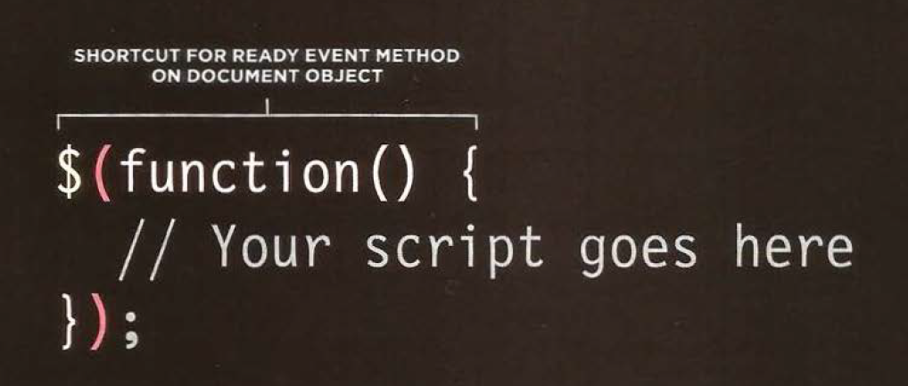
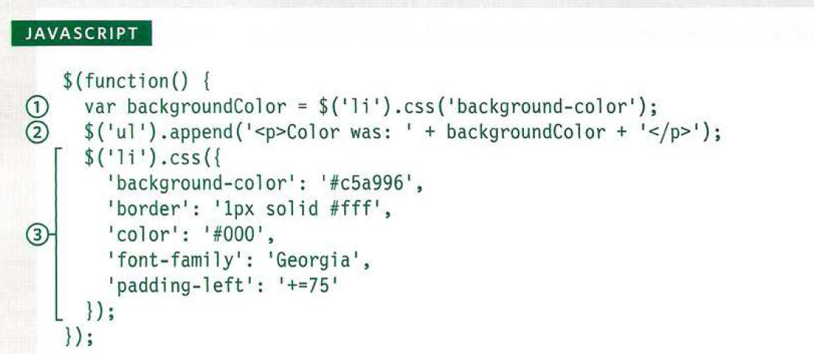
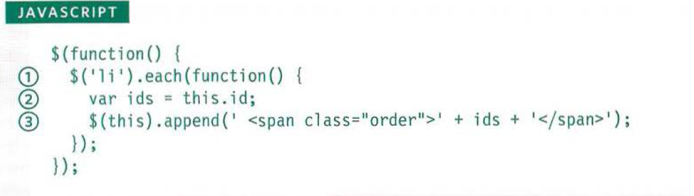
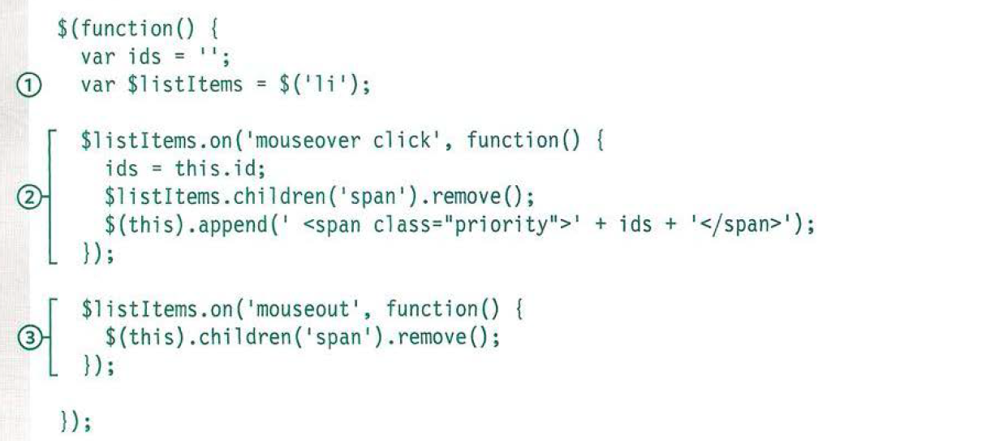
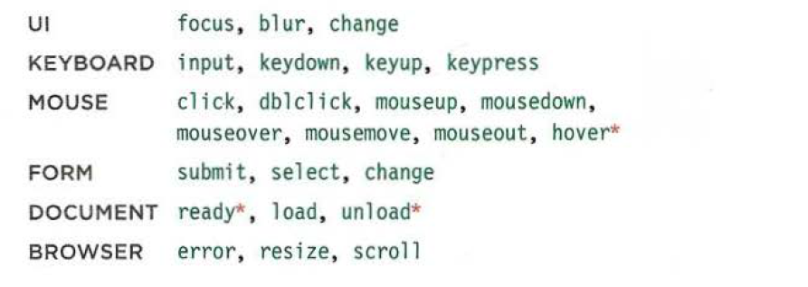

# Read 02 - jQuery, Events, and the DOM

**JS Book**
- pg 293-301
- pg 306-331
- pg 354-357
- BookMark : 302-305  
- BookMark: 332-335

## Common Methods

### Getting Elements
- .html()  
- .text()

### Updating Elements
- .html()  
- .text()  
- .replaceWith()  
- .remove()  

### Inserting Elements
1. Create New Element in a Jquery object
2. Use method to insert the content

- .before()  
- .prepend()  
- .after()  
- .append()  

### Getting and Setting Attribute Value
- .attr()
- .removeAttr()
- .addClass()
- .removeClass()

### Getting and Setting CSS Property
- .css()

### Working With each element in selection
- .each()
- this or $(this)

### Event Method

### JQuery Events

 
 

[Link back to Table of Contents](README.md)